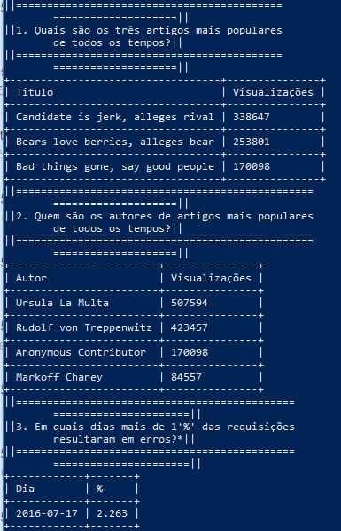

Udacity Log Analysis
==

> Console app to list analysis in log tables



# With Vagrant

## Prerequisites

- [vagrant](https://www.vagrantup.com/)

## Install

```shell
git clone https://github.com/paulorsouza/udacity-log-analysis.git
cd udacity-log-analysis

vagrant up
vagrant ssh
```

### Run

```shell
cd /vagrant/app
python3 analysis.py
```

### Run tests

```shell
cd /vagrant/app
pytest
```

# Without Vagrant

## Prerequisites

- [postgresql](https://www.postgresql.org/)
- [python3](https://www.python.org/download/releases/3.0/)
- [pip3](https://docs.python.org/3/installing/index.html)

## Install

```shell
pip3 install --upgrade pip
pip3 install texttable psycopg2 psycopg2-binary
pip3 install -U pytest
```

## Data

[Download data](https://d17h27t6h515a5.cloudfront.net/topher/2016/August/57b5f748_newsdata/newsdata.zip)

Unzip newsdata.zip 

```shell
createdb news
psql news -f newsdata.sql
```

### Run

```shell
cd /app
python3 analysis.py
```

### Run tests

```shell
cd /app
pytest
```
